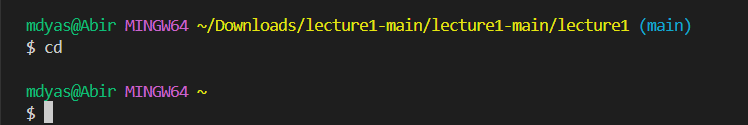
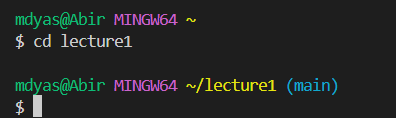
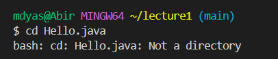
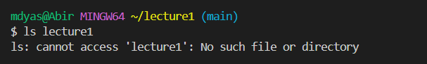
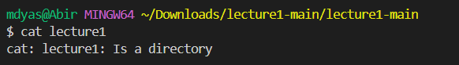
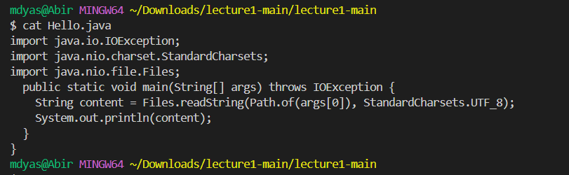

Command `cd` no argument
- The absolute path to the working directory right before the command was `/home/mdyas"`/home/mdyas.
- I got the output becasue `cd` is essentially used to change the directory but in this case since it had no argument then it is staying in the home directory.
- This is not an error because of the fact that it gave me the output that I was expecting as it is about staying in the home directory as there was no argument at all.

Command `cd` path directory
- The absolute path to the working directory right before the command was `/home/mdyas`.
- I got this answer because now I have successfully changed from the home directory and have entered a new directory named the "lecture1".
- This is not an error reather than a successful transition from one directory to another as it does not show that "no file exist".

Command `cd` with file name
- The absolute path to the working directory right before the command was "~/lecture1 (main)".
- I got this answer because Hello.java can not be a directory because it is a file instead and could not be considered as a directory to enter from another one.
- This is an error and the reason why is because we can not use cd in terms of files, more like we can use ls to open up files such as "Hello.java".

Command `ls` with no argument
- The absolute path to the working directory before the command was "/home/mdyas/lecture1".
- I got this answer because the code identified "messages" as a directory so it switched it to that from "/home/mdyas/lecture1".
- It is not an error because it has a successful transition from one directory to another.

  
Command `ls` with path directory
- The absolute path to the working directory before the command was "/home/mdyas/lecture1".
- I got this answer because in terms of ls "lecture1" can not be considered as a directory hence it gave us that as the answer.
- This is an error since it gave us "No such file or directory" as such directory does not exist.

Command `ls` with file name
- The absolute path to the working directory before the command was "/home/mdyas/lecture1".
- I got this answer becasue "ls" is lookingf for the file within the directory and thus when it finds the file which is "Hello.java".
- This is not an error because when the command is "ls" is run then the terminal is looking for the file withing the active directory which in this case is "Hello.java" so it gave me the expected answer.414

Command `cat` with no argument
- The absolute path to the working directory before the command was "/home/mdyas/lecture1".
- I got this answer because even after trying the command "cat" it does not know what it is looking for so it just came out as blank.
- It is not an error because the command "cat" does not know what it is looking to work on so thus it is normal to come out as blank so it is not a error.

Command `cat` with directory argument
- The absolute path to the working directory before the command was "/home/mdyas/Downloads/lecture1-main/lecture1-main".
- I got this answer because it can not find the content available in the "lecture1" since it is not a file but a directory instead.
- This is an error because when we run the command "cat" it is looking for a file where it can grab the content out of but rather than that it met a directory named "lecture1" for which it is giving out an error.

Command `cat` with file argument
- The absolute path to the working directory before the command was "/home/mdyas/Downloads/lecture1-main/lecture1-main".
- I got this answer because this time "cat" has met a file which has content available in it for which case it is pulling out all the information in the file named "Hello.java".
- This is not an error and it is mainly becasue "cat" is looking for a file to look for content in and it did found one named "Hello.java" in the directory named "lecture1".
